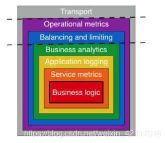
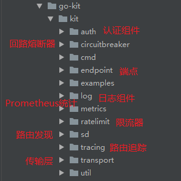

# go-kit整体结构

go-kit是一个go语言相关的微服务工具包，它自身称之为toolkit，并不是framework，go-kit将一系列的服务集合在一起，提供接口，从而让开发者自由组合搭建自己的为服务项目。go-kit的结构分为：传输层，端点层和服务层。

## transport(传输层)

传输层决定了用哪种方式提供服务请求，一般是http或rpc。

当你构建基于微服务的分布式系统时，服务通常使用HTTP或gRPC等具体传输或使用NATS等pub/sub系统相互通信。go-kit中的传输层绑定到具体运输。go-kit支持使用HTTP，gRPC，NATS，AMQP和Thrift提供服务的各种传输。

由于go-kit服务仅专注于实现业务逻辑，并且不了解具体传输，因此你可以为同一服务提供多个传输。例如，可以使用HTTP和gRPC公开单个Go工具包服务。

## endpoint(端点层)

端点层是服务器和客户端的基本构建块。在go-kit中，Go工具包服务中的每个服务方法都转换为端点，每个端点使用传输层通过使用HTTP或gRPC等具体传输将服务方法公开给外部世界，可以使用多个传输来公开单个端点。

对于RPC方式，一个RPC方法绑定一个Handler，一个Handler中封装了一个端点。对于HTTP方式，一个路由规则绑定一个Handler，Handler中同样封装了一个端点。

端点层是go-kit最重要的一个层，是一个抽象的接收请求返回响应的函数类型。在这个定义的类型里面会去调用service层的方法，组装成response返回。而go-kit中的所有中间件组件都是通过装饰者设计模式注入到端点层的。

## service(服务层)

业务逻辑在服务层中实现。为了方便多服务的切换，go-kit服务被建模为接口。

服务中的业务逻辑包含核心业务逻辑，它不应具有端点或HTTP或gRPC等具体传输的任何知识，或者请求和响应消息类型的编码和解码。这将鼓励你遵循基于Go套件的服务的干净架构。每种服务方法都通过使用适配器转换为端点，并使用具体传输进行公开。由于结构简洁，可以使用多个传输来公开单个Go工具包服务。

所有的具体方法写在这里，可以理解为单体web框架中的控制器部分。

## middleware(中间件)

go-kit通过强制分离关注点来鼓励良好的设计原则。使用中间件实现服务和端点的交叉组件。go-kit中的中间件是一种强大的机制，可以包装服务和端点以添加功能（交叉组件），例如日志记录，断路器，速率限制，负载平衡或分布式跟踪。

这是一张来自go-kit网站的图片，该图片描绘了一个带有中间件的典型go-kit设计层的洋葱模型。



在go-kit中，有两种中间件的使用模式，一种是使用go-kit中封装好的endpoint.Middleware结构

go-kit定义的中间件类型，为了组成链式结构，传入一个endpoint.Endpoint，返回一个endpoint.Endpoint，即包裹endpoint实现中间件。

```go
// Middleware is a chainable behavior modifier for endpoints.
type Middleware func(Endpoint) Endpoint
```

按照次函数签名创建一个日志中间件，在endpoint.Endpoint方法中进行处理。

```go
func LoggerMdw(logger log.Logger) endpoint.Middleware {
	return func(next endpoint.Endpoint) endpoint.Endpoint {
		return func(ctx context.Context, request interface{}) (response interface{}, err error) {
			r := request.(userendpoint.UserRequest)
			logger.Log("method", r.Method, "event", "get_user", "userid", r.Uid)
			return next(ctx, request)
		}
	}
}
```

使用时可以直接包裹endpoint.Endpoint，如果有多个中间件，可以使用endpoint.Chain()方法按顺序组织，此方法按顺序合并endpoint.Middleware并返回一个endpoint.Middleware。

另一种只用方式是包裹service实现中间件，首先service接口，用中间件实现这个接口，同时从里向外一层一层的继承。

```go
// 定义服务接口
type StringService interface {
	Uppercase(string) (string, error)
	Count(string) int
}

//实现服务接口
type stringService struct{}

func (stringService) Uppercase(s string) (string, error) {
	if s == "" {
		return "", ErrEmpty
	}
	return strings.ToUpper(s), nil
}

func (stringService) Count(s string) int {
	return len(s)
}

var ErrEmpty = errors.New("empty string")

//服务中间件
type ServiceMiddleware func(StringService) StringService


func loggingMiddleware(logger log.Logger) ServiceMiddleware {
	return func(next StringService) StringService {
		return logmw{logger, next}
	}
}

type logmw struct {
	logger log.Logger
	StringService
}

func (mw logmw) Uppercase(s string) (output string, err error) {
	defer func(begin time.Time) {
		_ = mw.logger.Log(
			"method", "uppercase",
			"input", s,
			"output", output,
			"err", err,
			"took", time.Since(begin),
		)
	}(time.Now())

	output, err = mw.StringService.Uppercase(s)
	return
}

func (mw logmw) Count(s string) (n int) {
	defer func(begin time.Time) {
		_ = mw.logger.Log(
			"method", "count",
			"input", s,
			"n", n,
			"took", time.Since(begin),
		)
	}(time.Now())

	n = mw.StringService.Count(s)
	return
}
```
## (toolkit)工具包

作为一个工具包，gokit为此提供了很多微服务工具组件，如下:



- 认证组件（basic, jwt）

- 回路熔断器

- 日志组件

- 普罗米修斯监控系统

- 限流器

- 服务发现系统接口（etcd, consul等）

- 路由跟踪

接下来深入源码逐个分析。


