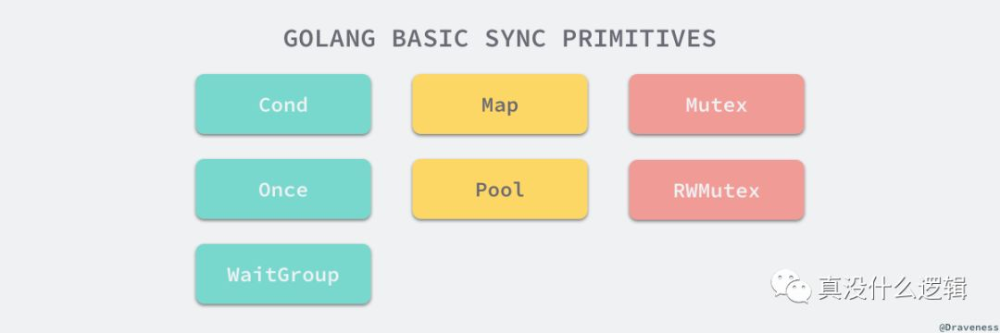

# sync包中的同步原语

在并发编程中，锁的主要作用就是保证多个线程或者 Goroutine 在访问同一片内存时不会出现混乱的问题，锁其实是一种并发编程中的同步原语（Synchronization Primitives）。

这里介绍 Go 语言中常见的同步原语 Mutex、RWMutex、WaitGroup、Once 和 Cond 的实现原理，同时也会涉及互斥锁、信号量等并发编程中的常见概念。

## 基本原语

Go 语言在 sync 包中提供了用于同步的一些基本原语，包括常见的互斥锁 Mutex 与读写互斥锁 RWMutex 以及 Once、WaitGroup、Cond。

这些基本原语的主要作用是提供较为基础的同步功能，我们应该使用 Channel 和通信来实现更加高级的同步机制。



### Mutex

#### 结构

Go 语言中的互斥锁在 sync 包中，它由两个字段 state 和 sema 组成，state 表示当前互斥锁的状态，而 sema 真正用于控制锁状态的信号量，这两个加起来只占 8 个字节空间的结构体就表示了 Go 语言中的互斥锁。

```go
type Mutex struct {
    state   int32
    sema    uint32
}
```

#### 状态

互斥锁的状态是用 int32 来表示的，但是锁的状态并不是互斥的，它的最低三位分别表示 mutexLocked、mutexWoken 和 mutexStarving，剩下的位置都用来表示当前有多少个 Goroutine 等待互斥锁被释放：


互斥锁在被创建出来时，所有的状态位的默认值都是 0，当互斥锁被锁定时 mutexLocked 就会被置成 1、当互斥锁被在正常模式下被唤醒时 mutexWoken 就会被被置成 1、mutexStarving 用于表示当前的互斥锁进入了状态，最后的几位是在当前互斥锁上等待的 Goroutine 个数。

#### 饥饿模式

饥饿模式是在 Go 语言 1.9 版本引入的特性，它的主要功能就是保证互斥锁的获取的『公平性』（Fairness）。

互斥锁可以同时处于两种不同的模式，也就是正常模式和饥饿模式，在正常模式下，所有锁的等待者都会按照先进先出的顺序获取锁，但是如果一个刚刚被唤起的 Goroutine 遇到了新的 Goroutine 进程也调用了 Lock 方法时，大概率会获取不到锁，为了减少这种情况的出现，防止 Goroutine 被『饿死』，一旦 Goroutine 超过 1ms 没有获取到锁，它就会将当前互斥锁切换饥饿模式。


在饥饿模式中，互斥锁会被直接交给等待队列最前面的 Goroutine，新的 Goroutine 在这时不能获取锁、也不会进入自旋的状态，它们只会在队列的末尾等待，如果一个 Goroutine 获得了互斥锁并且它是队列中最末尾的协程或者它等待的时间少于 1ms，那么当前的互斥锁就会被切换回正常模式。

相比于饥饿模式，正常模式下的互斥锁能够提供更好地性能，饥饿模式的主要作用就是避免一些 Goroutine 由于陷入等待无法获取锁而造成较高的尾延时，这也是对 Mutex 的一个优化。

#### 加锁过程

互斥锁 Mutex 的加锁是靠 Lock 方法完成的，最新的 Go 语言源代码中已经将 Lock 方法进行了简化，方法的主干只保留了最常见、简单并且快速的情况；当锁的状态是 0 时直接将 mutexLocked 位置成 1：

```go
func (m *Mutex) Lock() {
    if atomic.CompareAndSwapInt32(&m.state, 0, mutexLocked) {
        return
    }
    m.lockSlow()
}
```
但是当 Lock 方法被调用时 Mutex 的状态不是 0 时就会进入 lockSlow 方法尝试通过自旋或者其他的方法等待锁的释放并获取互斥锁，该方法的主体是一个非常大 for 循环，我们会将该方法分成几个部分介绍获取锁的过程：

```go
func (m *Mutex) lockSlow() {
    var waitStartTime int64
    starving := false
    awoke := false
    iter := 0
    old := m.state
    for {
        if old&(mutexLocked|mutexStarving) == mutexLocked && runtime_canSpin(iter) {
            if !awoke && old&mutexWoken == 0 && old>>mutexWaiterShift != 0 &&
                atomic.CompareAndSwapInt32(&m.state, old, old|mutexWoken) {
                awoke = true
            }
            runtime_doSpin()
            iter++
            old = m.state
            continue
        }
```
在这段方法的第一部分会判断当前方法能否进入自旋来等待锁的释放，自旋（Spinnig）其实是在多线程同步的过程中使用的一种机制，当前的进程在进入自旋的过程中会一直保持 CPU 的占用，持续检查某个条件是否为真，在多核的 CPU 上，自旋的优点是避免了 Goroutine 的切换，所以如果使用恰当会对性能带来非常大的增益。

在 Go 语言的 Mutex 互斥锁中，只有在普通模式下才可能进入自旋，除了模式的限制之外，runtime_canSpin 方法中会判断当前方法是否可以进入自旋，进入自旋的条件非常苛刻：

1. 运行在多 CPU 的机器上；

2. 当前 Goroutine 为了获取该锁进入自旋的次数小于四次；

3. 当前机器上至少存在一个正在运行的处理器 P 并且处理的运行队列是空的；

一旦当前 Goroutine 能够进入自旋就会调用 runtime_doSpin，它最终调用汇编语言编写的方法 procyield 并执行指定次数的 PAUSE 指令，PAUSE 指令什么都不会做，但是会消耗 CPU 时间，每次自旋都会调用 30 次 PAUSE，下面是该方法在 386 架构的机器上的实现：

```
TEXT runtime·procyield(SB),NOSPLIT,$0-0
    MOVL    cycles+0(FP), AX
again:
    PAUSE
    SUBL    $1, AX
    JNZ again
    RET
```

处理了自旋相关的特殊逻辑之后，互斥锁接下来就根据上下文计算当前互斥锁最新的状态了，几个不同的条件分别会更新 state 中存储的不同信息 mutexLocked、mutexStarving、mutexWoken 和 mutexWaiterShift：

```go
    new := old
        if old&mutexStarving == 0 {
            new |= mutexLocked
        }
        if old&(mutexLocked|mutexStarving) != 0 {
            new += 1 << mutexWaiterShift
        }
        if starving && old&mutexLocked != 0 {
            new |= mutexStarving
        }
        if awoke {
            new &^= mutexWoken
        }
```

计算了新的互斥锁状态之后，我们就会使用 atomic 包提供的 CAS 函数修改互斥锁的状态，如果当前的互斥锁已经处于饥饿和锁定的状态，就会跳过当前步骤，调用 runtime_SemacquireMutex 方法：

```go
 if atomic.CompareAndSwapInt32(&m.state, old, new) {
            if old&(mutexLocked|mutexStarving) == 0 {
                break // locked the mutex with CAS
            }
            queueLifo := waitStartTime != 0
            if waitStartTime == 0 {
                waitStartTime = runtime_nanotime()
            }
            runtime_SemacquireMutex(&m.sema, queueLifo, 1)
            starving = starving || runtime_nanotime()-waitStartTime > starvationThresholdNs
            old = m.state
            if old&mutexStarving != 0 {
                delta := int32(mutexLocked - 1<<mutexWaiterShift)
                if !starving || old>>mutexWaiterShift == 1 {
                    delta -= mutexStarving
                }
                atomic.AddInt32(&m.state, delta)
                break
            }
            awoke = true
            iter = 0
        } else {
            old = m.state
        }
    }
}
```
runtime_SemacquireMutex 方法的主要作用就是通过 Mutex 的使用互斥锁中的信号量保证资源不会被两个 Goroutine 获取，从这里我们就能看出 Mutex 其实就是对更底层的信号量进行封装，对外提供更加易用的 API，runtime_SemacquireMutex 会在方法中不断调用 goparkunlock 将当前 Goroutine 陷入休眠等待信号量可以被获取。

一旦当前 Goroutine 可以获取信号量，就证明互斥锁已经被解锁，该方法就会立刻返回，Lock 方法的剩余代码也会继续执行下去了，当前互斥锁处于饥饿模式时，如果该 Goroutine 是队列中最后的一个 Goroutine 或者等待锁的时间小于 starvationThresholdNs(1ms)，当前 Goroutine 就会直接获得互斥锁并且从饥饿模式中退出并获得锁。

#### 解锁过程

互斥锁的解锁过程相比之下就非常简单，Unlock 方法会直接使用 atomic 包提供的 AddInt32，如果返回的新状态不等于 0 就会进入 unlockSlow 方法：

```go
func (m *Mutex) Unlock() {
    new := atomic.AddInt32(&m.state, -mutexLocked)
    if new != 0 {
        m.unlockSlow(new)
    }
}
```

unlockSlow 方法首先会对锁的状态进行校验，如果当前互斥锁已经被解锁过了就会直接抛出异常 sync: unlock of unlocked mutex 中止当前程序，在正常情况下会根据当前互斥锁的状态是正常模式还是饥饿模式进入不同的分支：

```go
func (m *Mutex) unlockSlow(new int32) {
    if (new+mutexLocked)&mutexLocked == 0 {
        throw("sync: unlock of unlocked mutex")
    }
    if new&mutexStarving == 0 {
        old := new
        for {
            if old>>mutexWaiterShift == 0 || old&(mutexLocked|mutexWoken|mutexStarving) != 0 {
                return
            }
            new = (old - 1<<mutexWaiterShift) | mutexWoken
            if atomic.CompareAndSwapInt32(&m.state, old, new) {
                runtime_Semrelease(&m.sema, false, 1)
                return
            }
            old = m.state
        }
    } else {
        runtime_Semrelease(&m.sema, true, 1)
    }
}
```
如果当前互斥锁的状态是饥饿模式就会直接调用 runtime_Semrelease 方法直接将当前锁交给下一个正在尝试获取锁的等待者，等待者会在被唤醒之后设置 mutexLocked 状态，由于此时仍然处于 mutexStarving，所以新的 Goroutine 也无法获得锁。

在正常模式下，如果当前互斥锁不存在等待者或者最低三位表示的状态都为 0，那么当前方法就不需要唤醒其他 Goroutine 可以直接返回，当有 Goroutine 正在处于等待状态时，还是会通过 runtime_Semrelease 唤醒对应的 Goroutine 并移交锁的所有权

#### 小结

通过对互斥锁 Mutex 加锁和解锁过程的分析，我们能够得出以下的一些结论，它们能够帮助我们更好地理解互斥锁的工作原理，互斥锁的加锁的过程比较复杂，涉及自旋、信号量以及 Goroutine 调度等概念：

- 如果互斥锁处于初始化状态，就会直接通过置位 mutexLocked 加锁；

- 如果互斥锁处于 mutexLocked 并且在普通模式下工作，就会进入自旋，执行 30 次 PAUSE 指令消耗 CPU 时间等待锁的释放；

- 如果当前 Goroutine 等待锁的时间超过了 1ms，互斥锁就会被切换到饥饿模式；

- 互斥锁在正常情况下会通过 runtime_SemacquireMutex 方法将调用 Lock 的 Goroutine 切换至休眠状态，等待持有信号量的 Goroutine 唤醒当前协程；

- 如果当前 Goroutine 是互斥锁上的最后一个等待的协程或者等待的时间小于 1ms，当前 Goroutine 会将互斥锁切换回正常模式；

互斥锁的解锁过程相对来说就比较简单，虽然对于普通模式和饥饿模式的处理有一些不同，但是由于代码行数不多，所以逻辑清晰，也非常容易理解：

- 如果互斥锁已经被解锁，那么调用 Unlock 会直接抛出异常；

- 如果互斥锁处于饥饿模式，会直接将锁的所有权交给队列中的下一个等待者，等待者会负责设置 mutexLocked 标志位；

- 如果互斥锁处于普通模式，并且没有 Goroutine 等待锁的释放或者已经有被唤醒的 Goroutine 获得了锁就会直接返回，在其他情况下回通过 runtime_Semrelease 唤醒对应的 Goroutine；

### RWMutex

#### 结构

读写锁也是 Go 语言 sync 包为我们提供的接口之一，一个常见的服务对资源的读写比例会非常高，如果大多数的请求都是读请求，它们之间不会相互影响，那么我们为什么不能将对资源读和写操作分离呢？这也就是 RWMutex 读写互斥锁解决的问题，不限制对资源的并发读，但是读写、写写操作无法并行执行。

读写互斥锁在 Go 语言中的实现是 RWMutex，其中不仅包含一个互斥锁，还持有两个信号量，分别用于写等待读和读等待写：

```go
type RWMutex struct {
    w               Mutex
    writerSem       uint32
    readerSem       uint32
    readerCount     int32
    readerWait      int32
}
```
readerCount 存储了当前正在执行的读操作的数量，最后的 readerWait 表示当写操作被阻塞时等待的读操作个数。

#### 读锁

读锁的加锁非常简单，我们通过 atomic.AddInt32 方法为 readerCount 加一，如果该方法返回了负数说明当前有 Goroutine 获得了写锁，当前 Goroutine 就会调用 runtime_SemacquireMutex 陷入休眠等待唤醒：

```go
func (rw *RWMutex) RLock() {
    if atomic.AddInt32(&rw.readerCount, 1) < 0 {
        runtime_SemacquireMutex(&rw.readerSem, false, 0)
    }
}
```

如果没有写操作获取当前互斥锁，当前方法就会在 readerCount 加一后返回；当 Goroutine 想要释放读锁时会调用 RUnlock 方法：

```go
func (rw *RWMutex) RUnlock() {
    if r := atomic.AddInt32(&rw.readerCount, -1); r < 0 {
        rw.rUnlockSlow(r)
    }
}
```

该方法会在减少正在读资源的 readerCount，当前方法如果遇到了返回值小于零的情况，说明有一个正在进行的写操作，在这时就应该通过 rUnlockSlow 方法减少当前写操作等待的读操作数 readerWait 并在所有读操作都被释放之后触发写操作的信号量 writerSem：

```go
func (rw *RWMutex) rUnlockSlow(r int32) {
    if r+1 == 0 || r+1 == -rwmutexMaxReaders {
        throw("sync: RUnlock of unlocked RWMutex")
    }
    if atomic.AddInt32(&rw.readerWait, -1) == 0 {
        runtime_Semrelease(&rw.writerSem, false, 1)
    }
}
```

writerSem 在被触发之后，尝试获取读写锁的进程就会被唤醒并获得锁。

#### 读写锁

当资源的使用者想要获取读写锁时，就需要通过 Lock 方法了，在 Lock 方法中首先调用了读写互斥锁持有的 Mutex 的 Lock 方法保证其他获取读写锁的 Goroutine 进入等待状态，随后的 atomic.AddInt32(&rw.readerCount, -rwmutexMaxReaders) 其实是为了阻塞后续的读操作：

```go
func (rw *RWMutex) Lock() {
    rw.w.Lock()
    r := atomic.AddInt32(&rw.readerCount, -rwmutexMaxReaders) + rwmutexMaxReaders
    if r != 0 && atomic.AddInt32(&rw.readerWait, r) != 0 {
        runtime_SemacquireMutex(&rw.writerSem, false, 0)
    }
}
```
如果当前仍然有其他 Goroutine 持有互斥锁的读锁，该 Goroutine 就会调用 runtime_SemacquireMutex 进入休眠状态，等待读锁释放时触发 writerSem 信号量将当前协程唤醒。

对资源的读写操作完成之后就会将通过 atomic.AddInt32(&rw.readerCount, rwmutexMaxReaders) 变回正数并通过 for 循环触发所有由于获取读锁而陷入等待的 Goroutine：

```go
func (rw *RWMutex) Unlock() {
    r := atomic.AddInt32(&rw.readerCount, rwmutexMaxReaders)
    if r >= rwmutexMaxReaders {
        throw("sync: Unlock of unlocked RWMutex")
    }
    for i := 0; i < int(r); i++ {
        runtime_Semrelease(&rw.readerSem, false, 0)
    }
    rw.w.Unlock()
}
```
在方法的最后，RWMutex 会释放持有的互斥锁让其他的协程能够重新获取读写锁。

#### 小结

相比状态复杂的互斥锁 Mutex 来说，读写互斥锁 RWMutex 虽然提供的功能非常复杂，但是由于站在了 Mutex 的『肩膀』上，所以整体的实现上会简单很多。

- readerSem — 读写锁释放时通知由于获取读锁等待的 Goroutine；

- writerSem — 读锁释放时通知由于获取读写锁等待的 Goroutine；

- w 互斥锁 — 保证写操作之间的互斥；

- readerCount — 统计当前进行读操作的协程数，触发写锁时会将其减少 rwmutexMaxReaders 阻塞后续的读操作；

- readerWait — 当前读写锁等待的进行读操作的协程数，在触发 Lock 之后的每次 RUnlock 都会将其减一，当它归零时该 Goroutine 就会获得读写锁；

- 当读写锁被释放 Unlock 时首先会通知所有的读操作，然后才会释放持有的互斥锁，这样能够保证读操作不会被连续的写操作『饿死』；

RWMutex 在 Mutex 之上提供了额外的读写分离功能，能够在读请求远远多于写请求时提供性能上的提升，我们也可以在场景合适时选择读写互斥锁。


