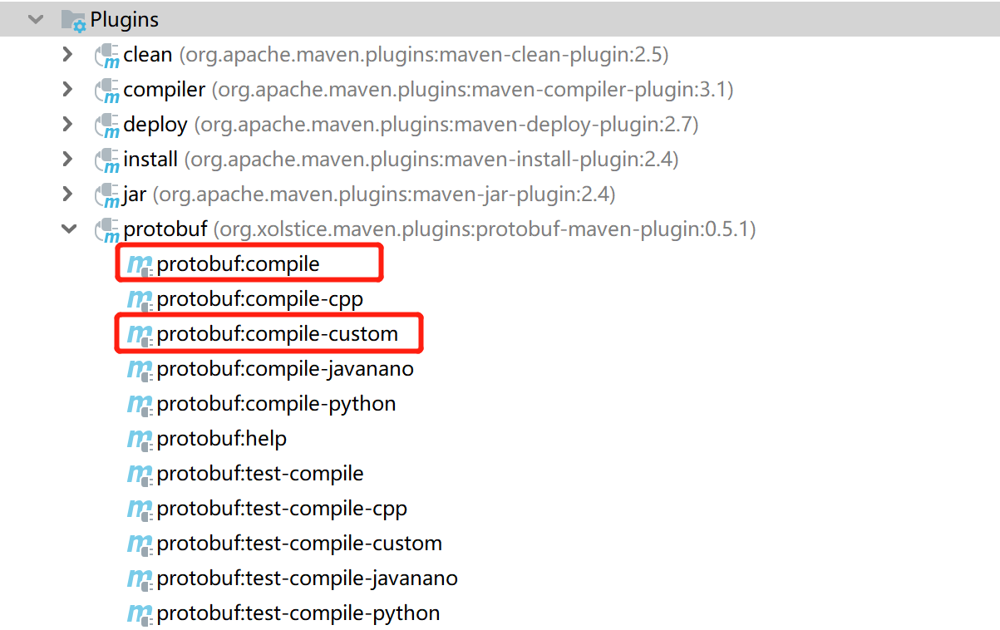

# grpc跨语言通信实例

都说grpc是一个跨语言的 rpc 框架，当团队内部使用多种编程语言时，grpc可以提供通信，这里我们通过一个Hello World来看看 Java 和 Go 是如何通信的。

## 以Go作为服务端，以Java作为客户端

### Go实现服务端

准备好 Go 的 proto 文件

```proto
syntax = "proto3";
package proto;
//接口请求入参
message HelloRequest{
    string request = 1;
}
//接口返回出参
message HelloResponse{
    string response = 1;
}
//定义接口
service HelloService{
    //一个简单的rpc
    rpc HelloWorld(HelloRequest) returns (HelloResponse){}
    //一个服务器端流式rpc
    rpc HelloWorldServerStream(HelloRequest) returns (stream HelloResponse){}
    //一个客户端流式rpc
    rpc HelloWorldClientStream(stream HelloRequest) returns (HelloResponse){}
    //一个客户端和服务器端双向流式rpc
    rpc HelloWorldClientAndServerStream(stream HelloRequest) 
          returns (stream  HelloResponse){}
}
```
下载依赖的module，如下地址：

```
github.com/golang/protobuf v1.3.2
google.golang.org/grpc v1.23.1
```
执行如下命令，生成 proto.pb.go 文件

```
protoc --goout=plugins=grpc:. helloworld.proto
```

服务端实现接口，提供服务

```go
type HelloServiceServer struct {
}
func (*HelloServiceServer) HelloWorld(ctx context.Context, 
        req *pb.HelloRequest) (*pb.HelloResponse, error) {
   //打印入参
   log.Printf("%v", req.Request)
   //响应服务
   return &pb.HelloResponse{Response: "hello my is gRpcServer"}, nil
}
```

编写服务端代码，并启动服务端

```go
func StartServer() {
   lis, err := net.Listen("tcp", "127.0.0.1:8090")
   if err != nil {
      log.Fatalf("failed to listen: %v", err)
   }
   //创建一个grpc服务器对象
   gRpcServer := grpc.NewServer()

   pb.RegisterHelloServiceServer(gRpcServer, &impl.HelloServiceServer{})
   //开启服务端
   gRpcServer.Serve(lis)
}
```
到次为止，Go 服务端启动完成，接下来我们准备 Java 客户端代码

### Java实现客户端

准备好 Java 版的 proto 文件，和 Go 版的区别是多了一些 Java 的选项，其余的不能改变

```go
syntax = "proto3";
package proto; //包名和go中的必须一致
option java_generic_services = true;
option java_multiple_files = true;
option java_package = "com.spw.proto";
option java_outer_classname = "HelloWorldProto";
//接口请求入参
message HelloRequest{
    string request = 1;
}
//接口返回出参
message HelloResponse{
    string response = 1;
}
//定义接口
service HelloService{
    //一个简单的rpc
    rpc HelloWorld(HelloRequest) returns (HelloResponse){}
    //一个服务器端流式rpc
    rpc HelloWorldServerStream(HelloRequest) returns (stream HelloResponse){}
    //一个客户端流式rpc
    rpc HelloWorldClientStream(stream HelloRequest) returns (HelloResponse){}
    //一个客户端和服务器端双向流式rpc
    rpc HelloWorldClientAndServerStream(stream HelloRequest) returns (stream HelloResponse){}
}
```
新建一个 maven 项目，配置 pom 文件，依赖的 jar 包如下

```xml
<dependencies>
    <dependency>
        <groupId>io.grpc</groupId>
        <artifactId>grpc-protobuf</artifactId>
        <version>1.23.1</version>
    </dependency>
    <dependency>
        <groupId>io.grpc</groupId>
        <artifactId>grpc-stub</artifactId>
        <version>1.23.1</version>
    </dependency>
    <dependency>
        <groupId>io.grpc</groupId>
        <artifactId>grpc-netty-shaded</artifactId>
        <version>1.23.1</version>
    </dependency>
</dependencies>
```
编译配置如下

```xml
<build>
    <plugins>
        <plugin>
            <groupId>org.springframework.boot</groupId>
            <artifactId>spring-boot-maven-plugin</artifactId>
        </plugin>
        <plugin>
            <groupId>org.xolstice.maven.plugins</groupId>
            <artifactId>protobuf-maven-plugin</artifactId>
            <version>0.5.1</version>
            <configuration>
                <!--proto编译器  os.detected.classifier，获取操作系统,这个属性是由
                ${os.detected.name}-${os.detected.arch}一起得来的-->
                <protocArtifact>
                com.google.protobuf:protoc:3.7.1:exe:${os.detected.classifier}
                </protocArtifact>
                <pluginId>grpc-java</pluginId>
                <!--grpc-java代码生成工具-->
                <pluginArtifact>
                io.grpc:protoc-gen-grpc-java:1.23.1:exe:${os.detected.classifier} 
                </pluginArtifact>
            </configuration>
            <executions>
                <execution>
                    <goals>
                        <goal>compile</goal>
                        <goal>compile-custom</goal>
                    </goals>
                </execution>
            </executions>
        </plugin>
    </plugins>
    <!--用于根据.proto 文件生成 protobuf 文件-->
    <extensions>
        <extension>
            <groupId>kr.motd.maven</groupId>
            <artifactId>os-maven-plugin</artifactId>
            <version>1.5.0.Final</version>
        </extension>
    </extensions>
</build>
```
开始根据 proto 文件编译生成 java 文件，如下图所示，依次点击红色的插件



编写客户端文件，连接 Go 的服务端，发起请求

```java
//通过netty创建通道
ManagedChannel channel = NettyChannelBuilder.forAddress("127.0.0.1", 8090)
        .negotiationType(NegotiationType.PLAINTEXT)
        .build();
//获取客户端存根对象
HelloServiceGrpc.HelloServiceBlockingStub blockingStub = HelloServiceGrpc.newBlockingStub(channel);
//创建入参
HelloRequest helloRequest = HelloRequest.newBuilder().setRequestBytes(ByteString.copyFromUtf8("hello grpc")).build();
//调用服务端
HelloResponse helloResponse = blockingStub.helloWorld(helloRequest);
//打印响应
System.out.println(helloResponse.getResponse());
```

## 以 Java 作为服务端，Go 作为客户端

### Java实现服务端

上面 Java 客户端生成的文件不要动，另写一个服务的实现类，代码如下

```java
public class HelloServiceImpl extends HelloServiceGrpc.HelloServiceImplBase {
    /**
     * <pre>
     *一个简单的rpc
     * </pre>
     */
    @Override
    public void helloWorld(HelloRequest request,
               io.grpc.stub.StreamObserver<HelloResponse>responseObserver) {

        responseObserver.onNext(HelloResponse.newBuilder()
                               .setResponse("hello my is java server").build());
        responseObserver.onCompleted();
    }
}
```
写一个 main 方法启动服务端，代码如下

```java
public static void main(String[] args) {
    try {
        CountDownLatch countDownLatch = new CountDownLatch(1);
        //启动服务端
        Server server = ServerBuilder.forPort(8090)
                    //添加自己的服务实现类
                    .addService(new HelloServiceImpl()).build().start();

        countDownLatch.await();
    } catch (IOException e) {
    } catch (InterruptedException e) {
    }
}
```
### Golang实现客户端

上面 go 服务端生成的 proto 文件依然不要变，实现自己的客户端代码，如下

```go
func StartClient() {
   conn, err := grpc.Dial("127.0.0.1:8090", grpc.WithInsecure())
   if err != nil {
      fmt.Println(err)
      return
   }
   //创建客户端存根对象
   c := pb.NewHelloServiceClient(conn)
   //调用服务
   res, err := c.HelloWorld(context.Background(), 
                            new(pb.HelloRequest), grpc.EmptyCallOption{})
   fmt.Println(res, err)
   defer conn.Close()
}
```

## 总结

通过一个 HelloWorld 的案例实践多语言通过 grpc 通信，真实场景中，往往非常复杂，还需要多多研究，比如，负载均衡，限流，服务降级，protobuffer 文件管理，版本升级等各种问题都需要考虑。

