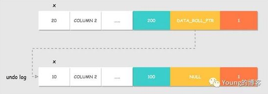
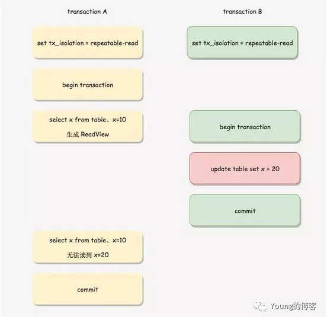
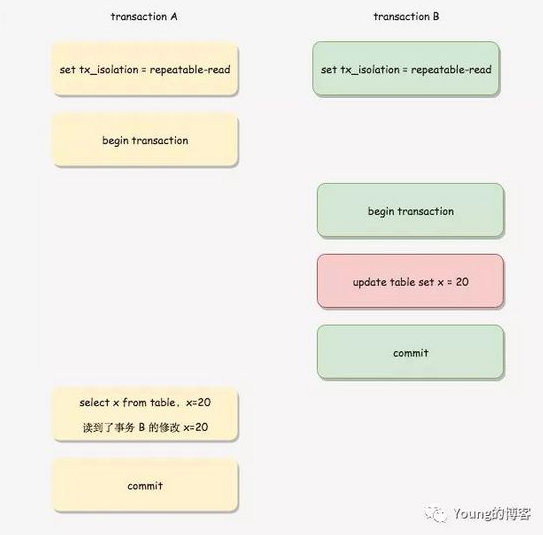
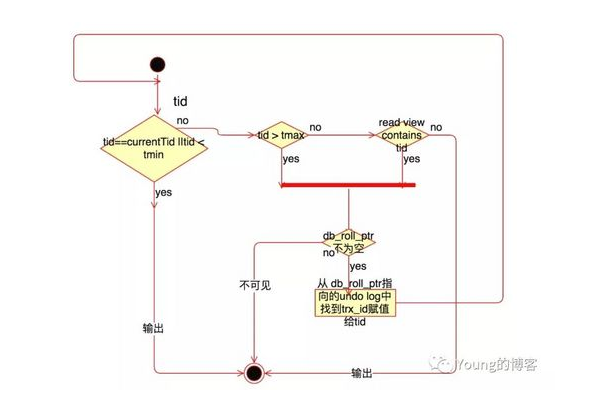

# InnoDB的事务实现机制

## 数据库的事务

数据库的事务具有ACID四个特征：

- A(Atomicity):原子性，整个数据库事务是不可分割的工作单位，只有事务中的所有的数据库操作都执行成功，才算整个事务成功。事务中任何一个SQL执行失败，已经执行成功的SQL语句也必须撤销，回到执行事务的之前的状态。

- C(Consistent):一致性，是指事务将数据库从一种一致性状态变为下一种一致性状态。在事务开始之前和之后，数据库的完整性约束没有被破坏。

- I(Isolation):隔离性，隔离性要求每个读写事务对其他事务的操作对象能相互分离。

- D(Durability):持久性，持久性指事务一旦提交，其结果就是永久性的。

## 并发事务的问题

数据库在处理并发事务时会遇到以下几个问题：

- 更新丢失(Lost Update)：当两个或多个事务选择同一行，然后基于最初选定的值更新该行时，由于每个事务都不知道其他事务的存在，就会发生丢失更新问题 —— 最后的更新覆盖了其他事务所做的更新。

- 脏读(Dirty Reads)：一个事务正在对一条记录做修改，在这个事务并提交前，这条记录的数据就处于不一致状态；这时，另一个事务也来读取同一条记录，如果不加控制，第二个事务读取了这些尚未提交的脏数据，并据此做进一步的处理，就会产生未提交的数据依赖关系。这种现象被形象地叫做"脏读"。

- 不可重复读(Non-Repeatable Reads)：一个事务按相同的查询条件读取某些数据，这些数据却发生了改变、或某些记录已经被删除了！这种现象叫做"不可重复读"。

- 幻读(Phantom Reads)：一个事务按相同的查询条件重新读取以前检索过的数据，却发现其他事务插入了满足其查询条件的新数据，这种现象就称为"幻读"。

## 事务的隔离级别

并发性能越好，并发产生的副作用越大，本质上，隔离级别是一种在并发性能和并发产生的副作用间的妥协，通常数据库均倾向于采用Weak Isolation。

在MySQL中有四种隔离级别：

- 未提交读(Read Uncommitted)：允许脏读，也就是可能读取到其他会话中未提交事务修改的数据。

- 提交读(Read Committed)：只能读取到已经提交的数据。Oracle等多数数据库默认都是该级别(不重复读)，Oracle数据库默认的隔离级别。

- 可重复读(Repeated Read)：可重复读。在同一个事务内的查询都是事务开始时刻一致的，InnoDB默认级别。在SQL标准中，该隔离级别消除了不可重复读，但是还存在幻象读，MySQL Innodb引擎默认的隔离级别。

- 串行读(Serializable)：完全串行化的读，每次读都需要获得表级共享锁，读写相互都会阻塞。

| 隔离级别  |  脏读(Dirty Read)  |  不可重复读(NonRepeatable Read)    |    幻读(Phantom Read)     |
| -------- | ------ | ---- | ------ |
| 未提交读(Read uncommitted)    |  可能    | 可能  | 可能  |
|  提交读(Read committed) | 不可能 | 可能  | 可能  |
| 可重复读(Repeatable read) | 不可能 | 不可能 | 可能 |
| 串行读(Serializable) | 不可能 | 不可能 | 不可能 |

## Undo Log和Redo Log

Undo Log是为了实现事务的原子性，在MySQL的InnoDB存储引擎中，还用Undo Log来实现多版本并发控制(MVCC)

### Undo Log

为了满足事务的原子性，在操作数据之前，首先将数据备份到一个地方(Undo Log)。然后进行数据的修改，如果出现了错误或者用户执行了ROLLBACK语句，系统可以利用Undo Log中的备份数据恢复到事务开始之前的状态。

除了可以保证事务的原子性，Undo Log也可以用来辅助完成事务的持久化。

Undo Log实现原子性和持久化事务的简化过程

假如有A，B两个数据，值分别为1，2

A. 事务开始

B. 记录A=1到undo log

C. 修改A=3

D. 记录B=2到undo log

E. 修改B=4

F. 将undo log 写到磁盘

G. 将数据写到磁盘

H. 事务提交

这里的数据都是先读到内存中，然后在内存中修改，最终将数据写入磁盘。

保证原子性和持久性在于以下特点：

- 更新数据前记录Undo Log

- 为了保证持久性，必须将数据在事务提交前写到磁盘。只要事务成功提交，数据必然已经持久化

- Undo Log必须先于数据持久化到磁盘。如果在G，H之间系统崩溃，Undo Log还是完整的，可以用来回滚事务。

- 如果在AF之间系统崩溃，因为数据没有持久化到磁盘，所以磁盘上的数据还是保持在事务开始之前的状态。

每个事务提交前将数据的Undo Log写入磁盘，这样会导致大量的磁盘IO，因此性能很低。如果能够将数据缓存一段时间，就能减少IO提高性能。但是这样就会丧失事务的持久性。因此引入了另外一种机制来实现持久化，即Redo Log。

### Redo Log

和Undo Log相反，Redo Log记录的是新数据的备份。在事务提交前，只要将Redo Log持久化即可，不需要将数据持久化。当系统崩溃时，虽然数据没有持久化，但是Redo Log已经持久化。系统可以根据Redo Log的内容，将所有数据恢复到最新的状态。

Undo Log + Redo Log事务的简化过程

A.事务开始.

B.记录A=1到undo log.

C.修改A=3.

D.记录A=3到redo log.

E.记录B=2到undo log.

F.修改B=4.

G.记录B=4到redo log.

H.将redo log写入磁盘。

I.事务提交

Undo Log + Redo Log事务的特点

- 为了保证持久性，必须在事务提交前将Redo Log持久化

- 数据不需要在事务提交前写入磁盘，而是缓存在内存中。

- Undo Log保证事务的原子性

- Redo Log保证事务的持久性

- 有一个隐含的特点，数据必须要晚于Redo Log写入持久存储

Undo Log + Redo Log的设计主要考虑时提升IO性能，虽然通过缓存数据，减少了写数据的IO，但是却引入了新的IO，即写Redo Log的IO。如果Redo Log的IO性能不好，就不能起到提高性能的目的。

InnoDB的Redo Log的设计有以下几个特点：

- 尽量保持Redo Log存储在一段连续的空间上。因此在系统第一次启动时就会将日志文件的空间完全分配。以顺序追加的方式记录Redo Log，通过顺序IO来改善性能。

- 批量写入日志。日志并不是直接写入文件，而是先写入Redo Log Buffer，当需要将日志刷新到磁盘时(如事务提交)，将许多日志一起写入磁盘

- 并发的事务共享Redo Log的存储空间，它们的Redo Log按语句的执行顺序，依次交替的记录在一起，以减少日志占用的空间。Redo Log中记录内容可能是这样的：

记录1:<trx1，insert…>

记录2:<trx2，update…>

记录3:<trx1，delete…>

记录4:<trx3，update…>

记录5:<trx2，insert…>

- 由于多个事务共享Redo Log，所以当一个事务将Redo Log写入磁盘时，也会将其他未提交的事务的日志写入磁盘。

- Redo Log上只进行顺序追加的操作，当一个事务需要回滚时，它的Redo Log记录也不会从Redo Log中删除掉。

### 恢复策略

未提交的事务和回滚了的事务也会记录Redo Log，因此在进行恢复时，这些事务要进行特殊的处理.有两种不同的恢复策略：

- 进行恢复时，只重做已经提交了的事务。

- 进行恢复时，重做所有事务包括未提交的事务和回滚了的事务。然后通过Undo Log回滚那些未提交的事务。

MySQL InnoDB引擎使用了第二种策略，在InnoDB引擎中，恢复机制有几个特点：

A.在重做Redo Log时，并不关心事务性。恢复时，没有BEGIN，也没有COMMIT，ROLLBACK的行为。也不关心每个日志是哪个事务的。尽管事务ID等事务相关的内容会记入Redo Log，这些内容只是被当作要操作的数据的一部分。

B.使用B策略就必须要将Undo Log持久化，而且必须要在写Redo Log之前将对应的Undo Log写入磁盘。

Undo和Redo Log的这种关联，使得持久化变得复杂起来。为了降低复杂度，InnoDB将Undo Log看作数据，因此记录Undo Log的操作也会记录到Redo Log中。这样undo log就可以象数据一样缓存起来，而不用在redo log之前写入磁盘了。

包含Undo Log操作的Redo Log，看起来是这样的：

记录1:<trx1，Undo Loginsert<undo_insert…>>

记录2:<trx1，insert…>

记录3:<trx2，Undo Loginsert<undo_update…>>

记录4:<trx2，update…>

记录5:<trx3，Undo Loginsert<undo_delete…>>

记录6:<trx3，delete…>

C.到这里，还有一个问题没有弄清楚。既然Redo没有事务性，那岂不是会重新执行被回滚了的事务？确实是这样。同时Innodb也会将事务回滚时的操作也记录到Redo Log中。回滚操作本质上也是对数据进行修改，因此回滚时对数据的操作也会记录到Redo Log中。一个回滚了的事务的Redo Log，看起来是这样的：

记录1:<trx1，Undo Loginsert<undo_insert…>>

记录2:<trx1，insertA…>

记录3:<trx1，Undo Loginsert<undo_update…>>

记录4:<trx1，updateB…>

记录5:<trx1，Undo Loginsert<undo_delete…>>

记录6:<trx1，deleteC…>

记录7:<trx1，insertC>

记录8:<trx1，updateBtooldvalue>

记录9:<trx1，deleteA>

一个被回滚了的事务在恢复时的操作就是先redo再undo，因此不会破坏数据的一致性.

## InnoDB MVCC实现原理

InnoDB  中  MVCC  的实现方式为：每一行记录都有两个隐藏列： DATA_TRX_ID 、 DATA_ROLL_PTR （如果没有主键，则还会多一个隐藏的主键列）。

- DATA_TRX_ID:记录最近更新这条行记录的事务ID ，大小为6个字节

- DATA_ROLL_PTR:表示指向该行回滚段(rollback segment)的指针，大小为7个字节，InnoDB便是通过这个指针找到之前版本的数据。该行记录上所有旧版本，在Undo Log中都通过链表的形式组织。

- DB_ROW_ID:行标识(隐藏单调自增ID)，大小为6字节，如果表没有主键，InnoDB会自动生成一个隐藏主键，因此会出现这个列。另外，每条记录的头信息(record header)里都有一个专门的bit(deleted_flag)来表示当前记录是否已经被删除。

### 如何组织版本链

在多个事务并行操作某行数据的情况下，不同事务对该行数据的UPDATE会产生多个版本，然后通过回滚指针组织成一条Undo Log链，我们通过一个简单的例子来看一下Undo Log链是如何组织的，DATA_TRX_ID和  DATA_ROLL_PTR两个参数在其中又起到什么样的作用。

事务A对值x进行更新之后，该行即产生一个新版本和旧版本。假设之前插入该行的事务ID为100，事务A的ID为200，该行的隐藏主键为1。

事务A的操作过程为：

对DB_ROW_ID = 1的这行记录加排他锁

把该行原本的值拷贝到Undo Log中，DB_TRX_ID和DB_ROLL_PTR都不动

修改该行的值这时产生一个新版本，更新DATA_TRX_ID为修改记录的事务ID，将DATA_ROLL_PTR指向刚刚拷贝到Undo Log链中的旧版本记录，这样就能通过DB_ROLL_PTR找到这条记录的历史版本。如果对同一行记录执行连续的UPDATE，Undo Log会组成一个链表，遍历这个链表可以看到这条记录的变迁

记录Redo Log ，包括Undo Log中的修改

那么INSERT和DELETE会怎么做呢？其实相比UPDATE这二者很简单，INSERT会产生一条新纪录，它的DATA_TRX_ID为当前插入记录的事务ID；DELETE某条记录时可看成是一种特殊的UPDATE，其实是软删，真正执行删除操作会在commit时，DATA_TRX_ID则记录下删除该记录的事务ID。

### 如何实现一致性读-ReadView

在RU隔离级别下，直接读取版本的最新记录就OK，对于SERIALIZABLE隔离级别，则是通过加锁互斥来访问数据，因此不需要MVCC的帮助。因此MVCC运行在RC和RR这两个隔离级别下，当InnoDB隔离级别设置为二者其一时，在SELECT数据时就会用到版本链

核心问题是版本链中哪些版本对当前事务可见？

InnoDB为了解决这个问题，设计了ReadView(可读视图)的概念。

#### RR下ReadView的生成

在RR隔离级别下，每个事务touch first read时(本质上就是执行第一个SELECT语句时，后续所有的SELECT都是复用这个ReadView，其它update,delete,insert语句和一致性读snapshot的建立没有关系)，会将当前系统中的所有的活跃事务拷贝到一个列表生成ReadView。

下图中事务A第一条SELECT语句在事务B更新数据前，因此生成的ReadView在事务A过程中不发生变化，即使事务B在事务A之前提交，但是事务A第二条查询语句依旧无法读到事务B的修改。

下图中，事务A的第一条SELECT语句在事务B的修改提交之后，因此可以读到事务B的修改。但是注意，如果事务A的第一条SELECT语句查询时，事务B还未提交，那么事务A也查不到事务B的修改。

#### RC下ReadView的生成

在RC隔离级别下，每个SELECT语句开始时，都会重新将当前系统中的所有的活跃事务拷贝到一个列表生成ReadView。二者的区别就在于生成ReadView的时间点不同，一个是事务之后第一个SELECT语句开始、一个是事务中每条SELECT语句开始。

ReadView中是当前活跃的事务ID列表，称之为m_ids，其中最小值为up_limit_id，最大值为low_limit_id，事务ID是事务开启时InnoDB分配的，其大小决定了事务开启的先后顺序，因此我们可以通过ID的大小关系来决定版本记录的可见性，具体判断流程如下：

- 如果被访问版本的trx_id小于m_ids中的最小值up_limit_id，说明生成该版本的事务在ReadView生成前就已经提交了，所以该版本可以被当前事务访问。

- 如果被访问版本的trx_id大于m_ids列表中的最大值low_limit_id，说明生成该版本的事务在生成ReadView后才生成，所以该版本不可以被当前事务访问。需要根据Undo Log链找到前一个版本，然后根据该版本的DB_TRX_ID重新判断可见性。

- 如果被访问版本的trx_id属性值在m_ids列表中最大值和最小值之间(包含)，那就需要判断一下trx_id的值是不是在m_ids列表中。如果在，说明创建ReadView时生成该版本所属事务还是活跃的，因此该版本不可以被访问，需要查找Undo Log链得到上一个版本，然后根据该版本的DB_TRX_ID再从头计算一次可见性；如果不在，说明创建ReadView时生成该版本的事务已经被提交，该版本可以被访问。

- 此时经过一系列判断我们已经得到了这条记录相对ReadView来说的可见结果。此时，如果这条记录的delete_flag为true，说明这条记录已被删除，不返回。否则说明此记录可以安全返回给客户端。

#### RC下的MVCC判断流程

我们现在回看刚刚的查询过程，为什么事务B在RC隔离级别下，两次查询的x值不同。RC下ReadView是在语句粒度上生成的。

当事务A未提交时，事务B进行查询，假设事务B的事务ID为300，此时生成ReadView的m_ids为[200，300]，而最新版本的trx_id为200，处于m_ids中，则该版本记录不可被访问，查询版本链得到上一条记录的trx_id为100，小于m_ids的最小值200，因此可以被访问，此时事务B就查询到值10而非20。

待事务A提交之后，事务B进行查询，此时生成的ReadView的m_ids为[300]，而最新的版本记录中trx_id为200 ，小于m_ids的最小值300，因此可以被访问到，此时事务B就查询到20。

#### RR下的MVCC判断流程

如果在RR隔离级别下，为什么事务B前后两次均查询到10呢？ RR下生成ReadView是在事务开始时，m_ids[200,300]，后面不发生变化，因此即使事务A提交了，trx_id为200的记录依旧处于m_ids中，不能被访问，只能访问版本链中的记录10。

### 总结

RC、RR两种隔离级别的事务在执行普通的读操作时，通过访问版本链的方法，使得事务间的读写操作得以并发执行，从而提升系统性能。RC、RR这两个隔离级别的一个很大不同就是生成ReadView的时间点不同，RC在每一次SELECT语句前都会生成一个ReadView，事务期间会更新，因此在其他事务提交前后所得到的m_ids列表可能发生变化，使得先前不可见的版本后续又突然可见了。而RR只在事务的第一个SELECT语句时生成一个ReadView，事务操作期间不更新。
