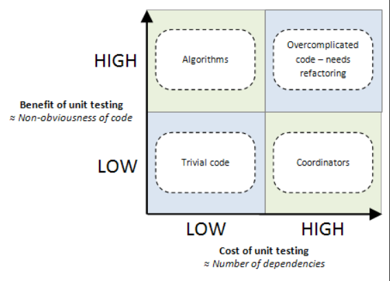

# Go单元测试-基础原理

单元测试是代码质量的保证。Go对单元测试的支持相当友好，标准包中就支持单元测试，我们从单元测试的基本思想和原理入手，一起来看看如何基于Go提供的标准测试包来进行单元测试。

## 单元测试的难点

### 掌握单元测试的粒度

单元测试粒度是十分让人头疼的问题，特别是对于初尝单元测试的程序员。测试粒度做的太细，会耗费大量的开发以及维护时间，每修改一个方法，都要改动其对应的测试方法。当发生代码重构的时候简直是噩梦。如果单元测试的粒度太粗，一个单元测试方法测试了n多方法，那么单元测试将显得非常臃肿，脱离了单元测试的本意，容易把单元测试写成集成测试。

### 破除外部依赖(mock stub技术)

单元测试一般不允许有任何的外部依赖(文件依赖，网络依赖，数据库依赖等)，我们不会在测试代码中去连接数据库，调用api等。这些外部依赖在执行测试的时候要被模拟(mock/stub)。在测试的时候，我们使用模拟的对象来模拟真实依赖下的各种行为，如何运用mock/stub来模拟系统的真实行为算是单元测试道路上的一只拦路虎。有的时候模拟是有效的，方便的，但是我们要提防过度的mock/stub，因为其会导致单元测试主要在测模拟对象而不是实际的系统。

## 权衡成本和收益

在受益于单元测试的好处的同时，也必然增加了代码量以及维护成本。下面的这张成本/价值像限图很清晰的阐述了不同性质的系统中单元测试价值和成本之间的关系。



### 依赖很少的简单的代码(左下)

对外部依赖少，又简单的代码。自然其成本和价值都是比较低的，举Go官方库里errors包为例，整个包就两个方法New()和Error()，没有任何外部依赖，代码也很简单，所以其单元测试起来也相当方便。

### 依赖较多但是很简单的代码(右下)

依赖一多，mock和stub就必然增多，单元测试的成本也就随之增加。但代码又如此简单，这个时候写单元测试的成本已经大于其价值，还不如不写单元测试。

### 依赖很少的复杂代码(左上)

像这样一类代码，是最有价值写单元测试的。比如一些独立的复杂算法(银行利息计算，保险费率计算，TCP协议解析等)，像这样一类代码外部依赖少，但却很容易出错，如果没有单元测试，几乎不能保证代码质量。

### 依赖很多又很复杂(右上)

这种代码显然是单元测试的噩梦。写单元测试，代价昂贵，不写单元测试，风险太高。像这种代码我们尽量在设计上将其分为两部分：1.处理复杂的逻辑部分 2.处理依赖的部分，然后1部分进行单元测试

## 迈出单元测试第一步

### 识别依赖，抽象成接口

识别系统中的外部依赖，普遍来说，我们遇到的最常见的依赖无非下面几种：

1. 网络依赖：函数执行依赖于网络请求，比如第三方http-api，rpc服务，消息队列等等。

2. 数据库依赖

3. IO依赖(文件)

当然，还有可能是依赖还未开发完成的功能模块。但是处理方法都是大同小异的——抽象成接口，通过mock和stub进行模拟测试。

### 明确需要测什么

当我们开始敲产品代码的时候，必然已经过初步设计，已经了解了系统中的外部依赖和业务复杂的部分，这部分是要优先考虑写单元测试的。在写每一个方法/结构体的时候同时思考这个方法/结构体需不需要测试？如何测试？对于什么样的方法/结构体需要测试，什么样的可以不做，除了上面的成本/价值像限图中获得答案外，还可以参考下面关于单元测试粒度要做多细问题的回答

>老板为我的代码付报酬，而不是测试，所以，我对此的价值观是——测试越少越好，少到你对你的代码质量达到了某种自信（我觉得这种的自信标准应该要高于业内的标准，当然，这种自信也可能是种自大）。如果我的编码生涯中不会犯这种典型的错误（如：在构造函数中设了个错误的值），那我就不会测试它。我倾向于去对那些有意义的错误做测试，所以，我对一些比较复杂的条件逻辑会异常地小心。当在一个团队中，我会非常小心的测试那些会让团队容易出错的代码

## Mock和Stub怎么做

Mock(模拟)和Stub(桩)是在测试过程中，模拟外部依赖行为的两种常用的技术手段。通过Mock和Stub我们不仅可以让测试环境没有外部依赖，而且还可以模拟一些异常行为，如数据库服务不可用，没有文件访问权限等。

### Mock和Stub的区别

在Go语言中，可以这样描述Mock和Stub：

- Mock：在测试包中创建一个结构体，满足某个外部依赖的接口

- Stub：在测试包中创建一个模拟方法，用于替换生成代码中的方法

#### Mock示例

生产代码：

```go
//auth.go
//假设我们有一个依赖http请求的鉴权接口
type AuthService interface{    
    Login(username string,password string) (token string,e error)   
    Logout(token string) error
}
```

mock代码：

```go
//auth_test.go
type authService struct {}
func (auth *authService) Login (username string,password string) (string,error){
    return "token", nil
}
func (auth *authService) Logout(token string) error{    
    return nil
}
```
在这里我们用authService实现了AuthService接口，这样测试Login，Logout就不再需要依赖网络请求了。而且我们可以模拟一些错误的情况进行测试：

```go
//auth_test.go
//模拟登录失败
type authLoginErr struct {
	auth AuthService  //可以使用组合的特性，Logout方法我们不关心，只用“覆盖”Login方法即可
}
func (auth *authLoginErr) Login (username string,password string) (string,error) {
	return "", errors.New("用户名密码错误")
}

//模拟api服务器宕机
type authUnavailableErr struct {
}
func (auth *authUnavailableErr) Login (username string,password string) (string,error) {
	return "", errors.New("api服务不可用")
}
func (auth *authUnavailableErr) Logout(token string) error{
	return errors.New("api服务不可用")
}
```
#### Stub示例

生产代码：

```go
//storage.go
//发送邮件
var notifyUser = func(username, msg string) { //<--将发送邮件的方法变成一个全局变量
    auth := smtp.PlainAuth("", sender, password, hostname)
    err := smtp.SendMail(hostname+":587", auth, sender,
        []string{username}, []byte(msg))
    if err != nil {
        log.Printf("smtp.SendEmail(%s) failed: %s", username, err)
    }
}
//检查quota,quota不足将发邮件
func CheckQuota(username string) {
    used := bytesInUse(username)
    const quota = 1000000000 // 1GB
    percent := 100 * used / quota
    if percent < 90 {
        return // OK
    }
    msg := fmt.Sprintf(template, used, percent)
    notifyUser(username, msg) //<---发邮件
}
```
显然，在跑单元测试的过程中，我们肯定不会真的给用户发邮件。这里采用了stub的方式来进行测试：

```go
//storage_test.go
func TestCheckQuotaNotifiesUser(t *testing.T) {
    var notifiedUser, notifiedMsg string
    notifyUser = func(user, msg string) {  //<-看这里就够了，在测试中，覆盖了发送邮件的全局变量
        notifiedUser, notifiedMsg = user, msg
    }

    // ...simulate a 980MB-used condition...

    const user = "joe@example.org"
    CheckQuota(user)
    if notifiedUser == "" && notifiedMsg == "" {
        t.Fatalf("notifyUser not called")
    }
    if notifiedUser != user {
        t.Errorf("wrong user (%s) notified, want %s",
            notifiedUser, user)
    }
    const wantSubstring = "98% of your quota"
    if !strings.Contains(notifiedMsg, wantSubstring) {
        t.Errorf("unexpected notification message <<%s>>, "+
            "want substring %q", notifiedMsg, wantSubstring)
    }
}
```
可以看到在go中用stub是侵入式的，必须将生产代码设计成可以用stub方法替换的形式。上述例子体现出来的结果就是：为了测试，专门用一个全局变量 notifyUser来保存了具有外部依赖的方法。然而在不提倡使用全局变量的Go语言当中，这显然是不合适的。所以，并不提倡这种Stub方式。

### Mock和Stub相结合

既然不提倡Stub方式，那是不是在Go测试当中就可以抛弃Stub了呢？原本我是这么认为的，但直到我读了这篇译文Golang 标准包布局译，虽然这篇译文讲的是包的布局，但里面的测试示例很值得学习。

```go
//生产代码 myapp.go
package myapp

type User struct {
    ID      int
    Name    string
    Address Address
}
//User的一些增删改查
type UserService interface {
    User(id int) (*User, error)
    Users() ([]*User, error)
    CreateUser(u *User) error
    DeleteUser(id int) error
}
```
常规mock方式：

```go
//测试代码 myapp_test.go
type userService struct{
}
func (u* userService) User(id int) (*User,error) {
	return &User{Id:1,Name:"name",Address:"address"},nil
}
//..省略其他实现方法

//模拟user不存在
type userNotFound struct {
	u UserService
}
func (u* userNotFound) User(id int) (*User,error) {
	return nil,errors.New("not found")
}

//其他...
```
一般来说，mock结构体内部很少会放变量，针对每一个要模拟的场景（比如上面的user不存在），最政治正确的方法应该是新建一个mock结构体。这样有两个好处：

mock出来的结构体十分简单，不需要进行额外的设置，不容易出错。
mock出来的结构体职责单一，测试代码自说明能力更强，可读性更高。

但在刚才提到的文章中，他是这么做的：

```go
//测试代码
// UserService 代表一个myapp.UserService.的 mock实现 
type UserService struct {
    UserFn      func(id int) (*myapp.User, error)
    UserInvoked bool

    UsersFn     func() ([]*myapp.User, error)
    UsersInvoked bool
    // 其他接口方法补全..
}

// User调用mock实现, 并标记这个方法为已调用
func (s *UserService) User(id int) (*myapp.User, error) {
    s.UserInvoked = true
    return s.UserFn(id)
}
```
这里不仅实现了接口，还通过在结构体内放置与接口方法函数签名一致的方法（ UserFnUsersFn...），以及 XxxInvoked是否调用标识符来追踪方法的调用情况。这种做法其实将mock与stub相结合了起来：在mock对象的内部放置了可以被测试函数替换的函数变量（ UserFn UsersFn...）。我们可以在我们的测试函数中，根据测试的需要，手动更换函数实现。

```go
//mock与stub结合的方式
func TestUserNotFound(t *testing.T) {
	userNotFound := &UserService{}
	userNotFound.UserFn = func(id int) (*myapp.User, error) { //<--- 设置UserFn的期望返回结果
		return nil,errors.New("not found")
	}
	//后续业务测试代码...
	
	if !userNotFound.UserInvoked {
		t.Fatal("没有调用User()方法")
	}
}

// 常规mock方式
func TestUserNotFound(t *testing.T) {
	userNotFound := &userNotFound{} //<---结构体方法已经决定了返回值
	//后续业务测试代码
}
```
通过将mock与stub结合，不仅能在测试方法中动态的更改实现，还追踪方法的调用情况，上述例子中只是追踪了方法是否被调用，实际中，如果有需要，我们也可以追踪方法的调用次数，甚至是方法的调用顺序：

```go
type UserService struct {
    UserFn      func(id int) (*myapp.User, error)
    UserInvoked bool
    UserInvokedTime int //<--追踪调用次数
    

    UsersFn     func() ([]*myapp.User, error)
    UsersInvoked bool

    // 其他接口方法补全..
    FnCallStack []string //<---函数名slice，追踪调用顺序
}

// User调用mock实现, 并标记这个方法为已调用
func (s *UserService) User(id int) (*myapp.User, error) {
    s.UserInvoked = true
    s.UserInvokedTime++ //<--调用发次数
	s.FnCallStack = append(s.FnCallStack,"User") //调用顺序
    return s.UserFn(id)
}
```
但同时，我们也会发现我们的mock结构体更复杂了，维护成本也随之增加了。两种mock风格各有各的好处，反正要记得软件工程没有银弹，合适的场景选用合适的方法就行了。 但总体而言，mock与stub相结合的这种方式的确是一种不错的测试思路，尤其是当我们需要追踪函数是否调用，调用次数，调用顺序等信息时，mock+stub将是我们的不二选择。

```go
//缓存依赖
type Cache interface{
	Get(id int) interface{} //获取某id的缓存 
	Put(id int,obj interface{}) //放入缓存
}

//数据库依赖
type UserRepository interface{
	//....
}
//User结构体
type User struct {
	//...
}
//userservice
type UserService interface{
	cache Cache 
	repository UserRepository
}

func (u *UserService) Get(id int) *User {
	//先从缓存找，缓存找不到在去repository里面找
}

func main() {   
	userService := NewUserService(xxx) //注入一些外部依赖
	user := userService.Get(2) //获取id = 2的user
}
```

现在要测试 userService.Get(id)方法的行为：

- Cache命中之后是否还查数据库？（不应该再查了）

- Cache未命中的情况下是否会查库？
....

这种测试通过mock+stub结合做起来将会非常方便，作为小练习，可以尝试自己实现一下。

## 使用依赖注入传递接口

接口需要以依赖注入的方式注入到结构体中，这样才能为测试提供替换接口实现的可能。比如形如下面的写法是无法测试的：

```go
type A interface {   
    Fun1() 
}
func (f *Foo) Bar() {    
    a := NewInstanceOfA(...参数若干) //生成A接口的某个实现    
    a.Fun1()  //调用接口方法
}
```
当你辛辛苦苦的将A接口mock出来后，却发现你根本没有办法在Bar()方法中将mock对象替换进去。下面来看看正确的写法：

```go
type A interface {    
    Fun1() 
}
type Foo struct {   
    a A // A接口
}
func (f *Foo) Bar() {   
    f.a.Fun1() //调用接口方法
}
// NewFoo, 通过构造函数的方式，将A接口注入
func NewFoo(a A) *Foo {     
    return &Foo{a: A}
}
```
在例子中我们使用了构造函数传参的方法来做依赖注入（当然你也可以用setter的方式做）。在测试的时候，就可以通过NewFoo()方法将我们的mock对象传递给*Foo了。

> 通常我们会在main.go中进行依赖注入

## 总结一下

单元测试的几个关键步骤：

1. 识别依赖（网络，文件，未完成的功能等等）

2. 将依赖抽象成接口

3. 在main.go中使用依赖注入方式将接口注入

